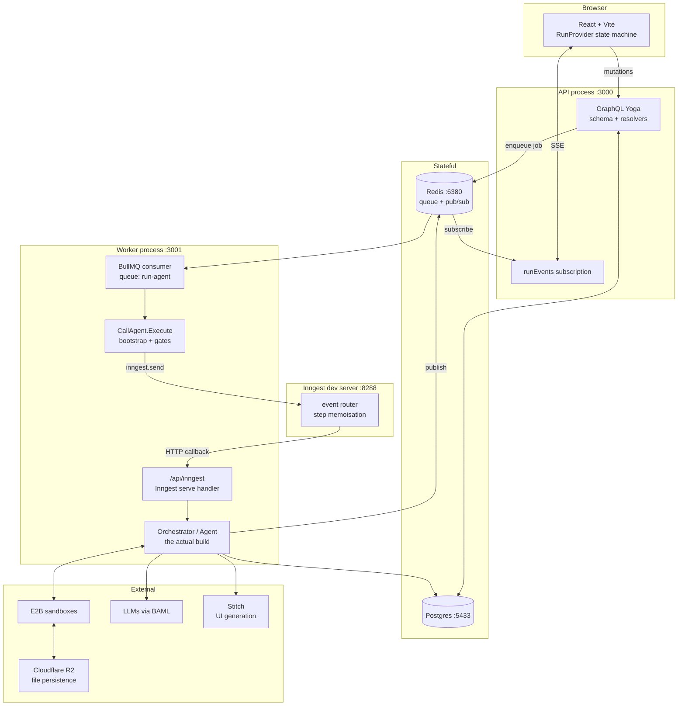
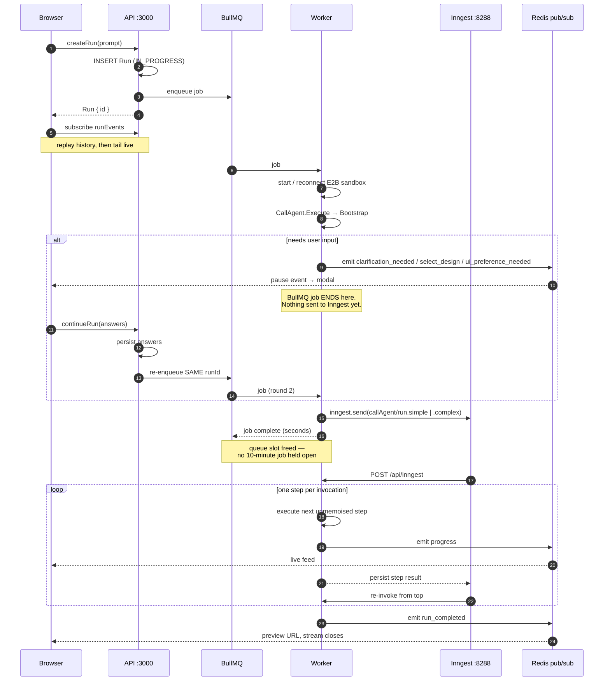
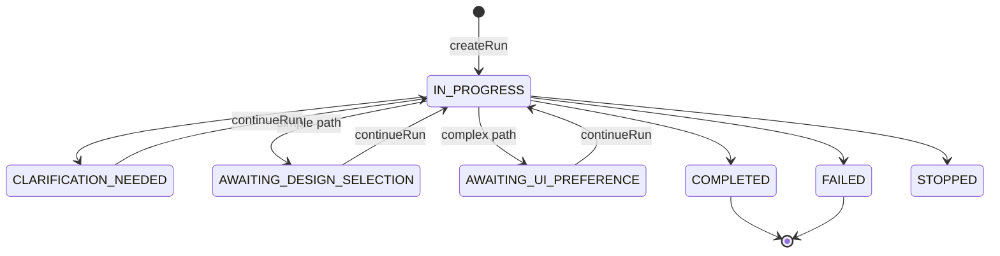
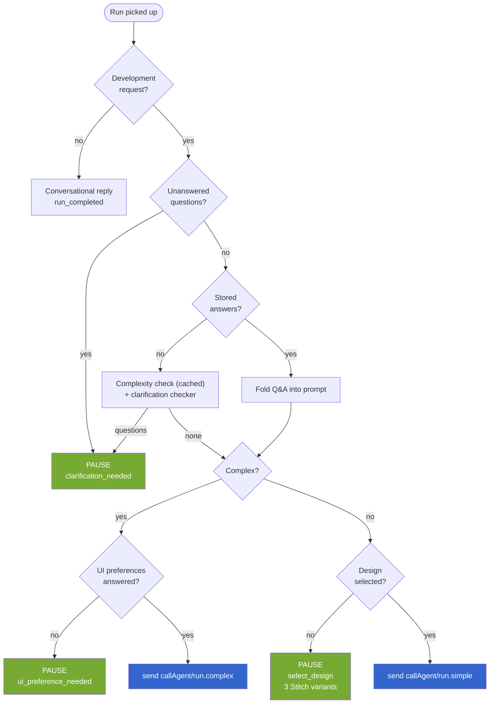
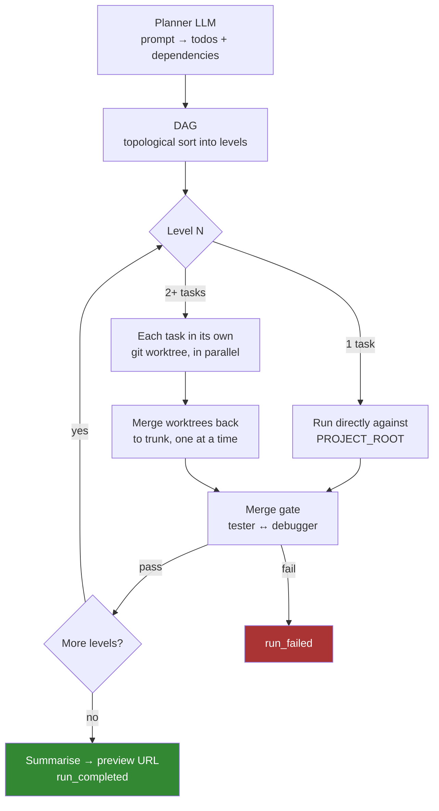
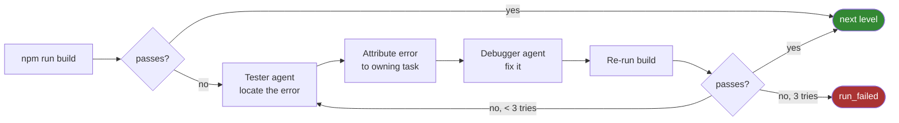
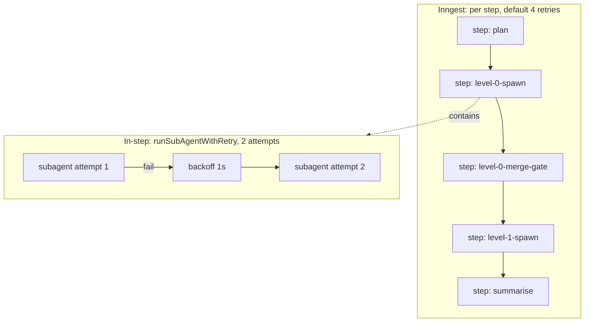
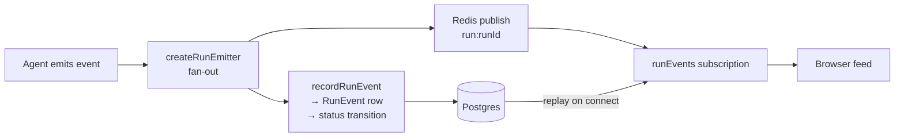

# Architecture

A multi-agent code-generation system. A user prompt becomes a running React app,
built by a DAG of specialised LLM agents working inside isolated sandboxes.

The interesting engineering is in three places: **where work is allowed to pause
and resume**, **how long-running agent work survives process death**, and **how
parallel agents avoid clobbering each other's files**.

---

## 1. System topology

Three processes, deliberately split by what they're allowed to load.

The API process never imports the agent graph — it only knows how to enqueue.
The worker owns everything heavy, and doubles as the Inngest function host so
Inngest's callbacks land in the process that already has the code loaded.

---

## 2. Request lifecycle

The part most people get wrong: a build is **not** one long request. It's a
short interactive phase that may pause for user input several times, followed by
a durable background phase.

---

## 3. Run state machine

Every pause is a real persisted state, so a refresh or a worker restart resumes
cleanly rather than orphaning the run.

Status transitions are driven by emitted events through a single
`STATUS_FOR_EVENT` map, so the event stream and the database can't disagree.

---

## 4. Bootstrap — the gate chain

Everything that might need to ask the user a question happens here, before any
durable work is dispatched.

The two paths diverge on purpose. A simple request gets three generated design
variants to pick from. A complex one skips that entirely — instead it asks a
small set of project-wide UI preference questions once, stores them, and every
UIExpert task from then on reuses the answers.

---

## 5. Complex path — planner, DAG, parallel execution

Parallel tasks at the same DAG level each get a **git worktree**, so two agents
editing the project at once can't corrupt each other. Merges happen serially
afterwards; a genuine conflict surfaces as that task failing rather than being
silently lost.

Agent roles: `coder`, `uiExpert`, `tester`, `debuggerr`, `researcher`.

---

## 6. Merge gate — the self-healing loop

After every level, the build must actually compile before moving on.

Errors are attributed back to the task whose files they came from, so the
debugger gets task context rather than a bare stack trace. Capped at
3 iterations, with repeat-signature detection so it doesn't loop on an error it
isn't actually fixing.

---

## 7. Durability — two retry layers

The two layers absorb different failures. Ordinary LLM flakiness is retried
**inside** a step, so it never consumes an Inngest attempt. Process death,
sandbox loss and infra failures are absorbed by Inngest **replay** — completed
steps return memoised results instantly, so a crash during level 3 resumes at
level 3 rather than rebuilding from scratch.

This is why orchestrator state is a plain serialisable shape: every value
crossing a step boundary is JSON round-tripped, and a `Map` would silently come
back as `{}`.

---

## 8. Real-time updates

Every event is written **and** published. Redis drives the live feed; the
`RunEvent` table makes a refresh mid-build replay the whole history. Pause
events are excluded from replay and served from a `runState` query instead, so
reconnecting never re-triggers a modal the user already answered.

---

## Stack

| Layer | Choice |
|---|---|
| Monorepo | Turborepo + Bun |
| API | GraphQL Yoga, Prisma, Postgres |
| Queue | BullMQ on Redis |
| Durable execution | Inngest |
| LLM interface | BAML (typed, schema-validated) |
| Sandboxes | E2B, git worktrees for isolation |
| File persistence | Cloudflare R2 |
| UI generation | Stitch |
| Observability | Langfuse tracing |
